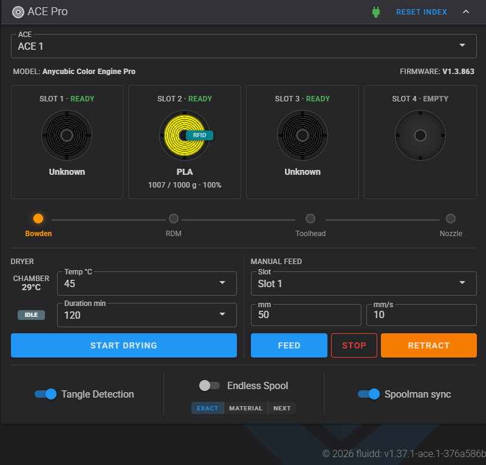

# Fluidd - ACE Pro Edition

> **Unofficial community fork of [Fluidd](https://github.com/fluidd-core/fluidd)** that adds a
> native **Anycubic ACE Pro** dashboard panel. Not affiliated with or endorsed by the Fluidd
> team or Anycubic. Licensed **GPL-3.0** (same as upstream). **Use at your own risk - no warranty.**

> ⚠️ **This is my personal customization, not a product.** It is tailored to **my own printer
> and setup** (a specific Anycubic ACE Pro on a Kobra-S1-lineage Klipper driver, named
> filament sensors, FilaMan, custom macros) and **deviates from the source repos**. It is
> public **only so my own printer can auto-update conveniently** - not as a general release.
> The chance it works as a **drop-in replacement** on a different setup is **very low**: it
> assumes macros, driver behaviour and config that are specific to me. **No support.** If you
> use any of it, expect to read and adapt it yourself - see
> [CREDITS.md](CREDITS.md#my-setup-this-is-why-it-is-not-a-drop-in) for the exact driver,
> firmware and components I run.

A native Fluidd panel for the Anycubic ACE Pro (and ACE-compatible) multi-material units:
per-slot inventory with active-tool highlight, dryer control, manual feed/retract, endless
spool, tangle detection, a live sensor-driven filament path, RFID badge, and real spool
weights via FilaMan.

### Screenshot

### Credits

This panel builds on a chain of GPL-3.0 community work - full list in **[CREDITS.md](CREDITS.md)**:

- [Fluidd](https://github.com/fluidd-core/fluidd) - the Klipper web UI this forks (GPL-3.0)
- [swilsonnc/ACEPROK1Max](https://github.com/swilsonnc/ACEPROK1Max) - original native ACE panel for Fluidd/Mainsail (GPL-3.0)
- [jeng37/ACE-Mainsail-Fluidd-Patch](https://github.com/jeng37/ACE-Mainsail-Fluidd-Patch) - the "hybrid native" adaptation (for the Kobra-S1 driver) this panel's API layer derives from
- ACE Pro driver & research foundation: [ACEResearch](https://github.com/printers-for-people/ACEResearch), [DuckACE](https://github.com/utkabobr/DuckACE), [BunnyACE](https://github.com/BlackFrogKok/BunnyACE), [szkrisz/ACEPROSV08](https://github.com/szkrisz/ACEPROSV08), [ValgACE](https://github.com/agrloki/ValgACE), [Kobra-S1/ACEPRO](https://github.com/Kobra-S1/ACEPRO) - see [CREDITS.md](CREDITS.md)

---

# Fluidd

Fluidd is a free and open-source Klipper web interface for managing your 3d printer.

## Features

- Responsive UI, supports desktop, tablets and mobile
- Customizable layouts. Move any panel where YOU want
- Built-in color themes
- Manage multiple printers from one Fluidd install
- [See our docs for more!](https://docs.fluidd.xyz)

## Support & Documentation

See our [Docs](https://docs.fluidd.xyz).
Join our [Discord!](https://discord.gg/GZ3D5tqfcF).

## How to use?

Fluidd can be easily installed via [KIAUH](https://github.com/dw-0/kiauh), along with Klipper, Moonraker, and all of the required dependencies.

Please see the [docs](https://docs.fluidd.xyz) for help with installation and configuration.

## Where to download?

You can download the latest release [here](https://github.com/fluidd-core/fluidd/releases/latest).

Older releases can be found [here](https://github.com/fluidd-core/fluidd/releases).

## Docker support

We have an [official docker image](https://github.com/fluidd-core/fluidd/pkgs/container/fluidd), serving Fluidd by default on port 80.

For those who have specific security requirements and need/want to run an unprivileged container, we also have an [unprivileged docker image](https://github.com/fluidd-core/fluidd/pkgs/container/fluidd-unprivileged) available, serving Fluidd by default on port 8080.

Both of these docker images are updated for each release and on each commit.

## Official sponsors

LDO, Excellence in Motion. LDO is an official sponsor of Fluidd.

## Supporting Fluidd

Fluidd development is driven by passionate volunteers who dedicate their time to improving and expanding its capabilities.

Your sponsorship can help us enhance Fluidd, introduce new features, and ensure it remains accessible to all Klipper users.

Your support can make a significant impact on the evolution of Fluidd. Please consider [sponsoring Fluidd](https://github.com/sponsors/fluidd-core).

## Credits

A big thank you to:

- the [Voron Community](http://vorondesign.com/)
- Kevin O'Connor for [Klipper](https://github.com/Klipper3d/klipper)
- Eric Callahan for [Moonraker](https://github.com/Arksine/moonraker)
- Dominik Willner for [KIAUH](https://github.com/dw-0/kiauh)
- Ray for [MainsailOS](https://github.com/raymondh2/MainsailOS)

## Misc

This project is tested with BrowserStack
